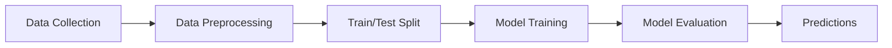

# 📊 Logistic Regression Binary Classification

A comprehensive implementation of **Logistic Regression** for binary classification tasks using Python and Jupyter Notebooks. This repository demonstrates fundamental machine learning concepts through hands-on exercises and practical examples.

---

## 📁 Repository Structure

```
Logistic-Regression-Binary-Classification/
├── 7_logistic_regression.ipynb          # Main implementation notebook
├── 7_logistic_regression_exercise.ipynb # Practice exercises
└── README.md                             # Project documentation
```

---

## 🎯 What is Logistic Regression?

**Logistic Regression** is a supervised machine learning algorithm used for **binary classification** problems. Despite its name, it's a classification algorithm (not regression) that predicts the probability of an instance belonging to a particular class.

### Key Characteristics:
- ✅ Used for binary classification (Yes/No, 0/1, True/False)
- ✅ Outputs probabilities between 0 and 1
- ✅ Uses sigmoid/logistic function for prediction
- ✅ Simple, interpretable, and fast
- ✅ Works well with linearly separable data

### Common Use Cases:
- Email spam detection (Spam/Not Spam)
- Disease diagnosis (Positive/Negative)
- Customer churn prediction (Churn/Retain)
- Credit default prediction (Default/No Default)
- Ad click prediction (Click/No Click)

---

## 📚 What You'll Learn

### Main Notebook (`7_logistic_regression.ipynb`):
- Mathematical foundation of logistic regression
- Sigmoid function and its properties
- Cost function (Log Loss/Binary Cross-Entropy)
- Gradient descent optimization
- Model training and evaluation
- Making predictions on new data

### Exercise Notebook (`7_logistic_regression_exercise.ipynb`):
- Hands-on practice problems
- Real-world dataset applications
- Model evaluation metrics (Accuracy, Precision, Recall, F1-Score)
- Confusion matrix analysis
- ROC curve and AUC

---

## 🛠️ Technologies Used

- **Python 3.x**
- **Jupyter Notebook**
- **NumPy** - Numerical computations
- **Pandas** - Data manipulation
- **Matplotlib/Seaborn** - Data visualization
- **Scikit-learn** - Machine learning implementation

---

## 🚀 Getting Started

### Prerequisites

Make sure you have Python 3.x installed on your system.

### Installation

1. **Clone the repository:**
   ```bash
   git clone https://github.com/Musawir456/Logistic-Regression-Binary-Classification.git
   cd Logistic-Regression-Binary-Classification
   ```

2. **Install required libraries:**
   ```bash
   pip install numpy pandas matplotlib seaborn scikit-learn jupyter
   ```

3. **Launch Jupyter Notebook:**
   ```bash
   jupyter notebook
   ```

4. **Open and run the notebooks:**
   - Start with `7_logistic_regression.ipynb` for the main tutorial
   - Then practice with `7_logistic_regression_exercise.ipynb`

---

## 💻 Usage Example

```python
# Import necessary libraries
import numpy as np
from sklearn.linear_model import LogisticRegression
from sklearn.model_selection import train_test_split

# Load your data
X, y = load_data()  # Your features and labels

# Split into training and testing sets
X_train, X_test, y_train, y_test = train_test_split(X, y, test_size=0.2, random_state=42)

# Create and train the model
model = LogisticRegression()
model.fit(X_train, y_train)

# Make predictions
predictions = model.predict(X_test)

# Evaluate accuracy
accuracy = model.score(X_test, y_test)
print(f"Model Accuracy: {accuracy * 100:.2f}%")
```

---

## 📊 Model Evaluation Metrics

The notebooks cover several important evaluation metrics:

| Metric | Description | Formula |
|--------|-------------|---------|
| **Accuracy** | Overall correctness | (TP + TN) / Total |
| **Precision** | Correct positive predictions | TP / (TP + FP) |
| **Recall** | Coverage of actual positives | TP / (TP + FN) |
| **F1-Score** | Harmonic mean of precision & recall | 2 × (Precision × Recall) / (Precision + Recall) |

Where:
- **TP** = True Positives
- **TN** = True Negatives
- **FP** = False Positives
- **FN** = False Negatives

---

## 📈 Project Workflow



1. **Data Collection** - Gather relevant dataset
2. **Data Preprocessing** - Clean, normalize, and prepare data
3. **Train/Test Split** - Divide data for training and testing
4. **Model Training** - Fit logistic regression model
5. **Model Evaluation** - Assess performance using metrics
6. **Predictions** - Make predictions on new data

---

## 🎓 Key Concepts Explained

### Sigmoid Function
```
σ(z) = 1 / (1 + e^(-z))
```
Maps any real value to a probability between 0 and 1.

### Decision Boundary
- If σ(z) ≥ 0.5 → Predict Class 1
- If σ(z) < 0.5 → Predict Class 0

### Cost Function (Log Loss)
```
J(θ) = -1/m × Σ[y×log(h(x)) + (1-y)×log(1-h(x))]
```
Measures how well the model fits the training data.

---

## 🔍 Notebooks Overview

### 1. Main Tutorial Notebook
**File:** `7_logistic_regression.ipynb`

**Contents:**
- Introduction to logistic regression
- Mathematical derivation
- Step-by-step implementation
- Visualization of decision boundaries
- Model evaluation

### 2. Exercise Notebook
**File:** `7_logistic_regression_exercise.ipynb`

**Contents:**
- Practice problems with real datasets
- Guided exercises with hints
- Challenge problems for advanced learners
- Solutions and explanations

---

## 🤝 Contributing

Contributions are welcome! Here's how you can help:

1. Fork the repository
2. Create a new branch (`git checkout -b feature/improvement`)
3. Make your changes
4. Commit your changes (`git commit -am 'Add new feature'`)
5. Push to the branch (`git push origin feature/improvement`)
6. Create a Pull Request

---

## 📝 License

This project is open source and available for educational purposes.

---

## 👤 Author

**Musawir456**

- GitHub: [@Musawir456](https://github.com/Musawir456)

---

## 🙏 Acknowledgments

- Thanks to the machine learning community for resources and inspiration
- Scikit-learn documentation for implementation guidance
- Open-source contributors

---

## 📚 Additional Resources

### Learn More About Logistic Regression:
- [Scikit-learn Documentation](https://scikit-learn.org/stable/modules/linear_model.html#logistic-regression)
- [StatQuest: Logistic Regression](https://www.youtube.com/watch?v=yIYKR4sgzI8)
- [Andrew Ng's Machine Learning Course](https://www.coursera.org/learn/machine-learning)

### Related Topics:
- Linear Regression
- Support Vector Machines (SVM)
- Decision Trees
- Neural Networks

---

## 📧 Contact

For questions, suggestions, or collaborations, feel free to reach out!

---

## ⭐ Show Your Support

If you found this project helpful, please give it a ⭐ on GitHub!

---

**Happy Learning! 🚀**

*Last Updated: February 2026*
